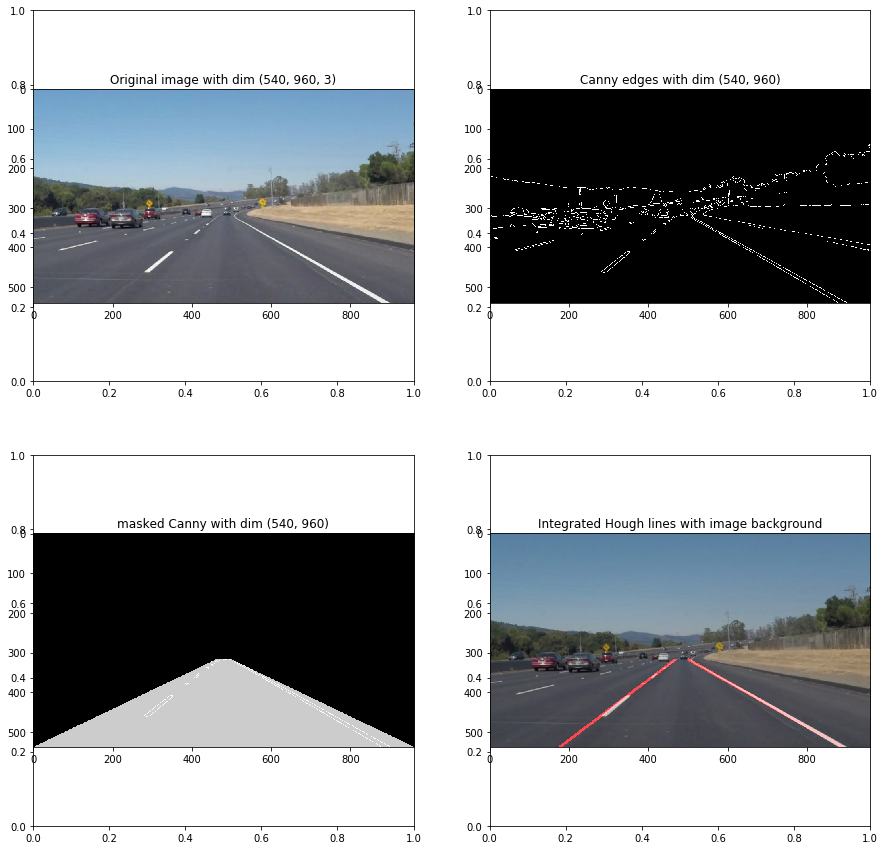

# **Finding Lane Lines on the Road** 

Ara Patapoutian, June 12 2017

---

#### Overview

- In this project the goal is to develop an algorithm  to detect lane lines
  - Lane lines are detected in images using Python and OpenCV
- In addition to this file, the project includes a file containing project code
  - The code file is called P1.ipynb
- The specifications in the project are listed [here](https://review.udacity.com/#!/rubrics/322/view)

There are four  steps in  this project:

1. Find lane-lines on the road given the provided test images
2. Apply the same procedure on movie clips
3. Improve **draw_lines()** function such that a lane is presented by a single line
4. Do further modifications to process the challenge clip

---

### Reflection

### 1. Pipeline description

- The pipeline flow is similar to the one described in class. Here are a sequence of plots to show intermediate steps

Added some helper functions
- *get_image()* takes an integer and returns an image
- *get_vertices()* takes the coordinate offsets and returns mask vertices
- *plot_images()* plots intermediate images to better understand what is going on

Defined most of my parameters outside the pipeline so that it is easily modified . As a result there is a single pipeline function that addresses all situations in this project
- for example, different *draw_lines()* algorithms were controlled through the *advanced* flag outside pipeline
- also, to address the challenge video,  the mask vertices were changed outside the pipeline

### 2. *draw_lines()* modifications

* The following modifications were applied to *draw_lines()* function:
  1.  For each Hough line determine 
     1. slope
     2. magnitude (see below why)
     3. y intercept
  2. Each Hough line is categorized as 
     1. part of the lane with positive slope  (when slope between 0.5 and 0.8)
     2. part of the lane with negative slope (when slope between -0.6 and -0.9)
     3. if a Hough line does not belong to the above 2 categories then it is discarded
  3. For each of the two retained sets, the slopes and y-intercepts are averaged
     * however, since longer lines are more reliable than shorter ones, I weighted the average slope and y-intercept by the magnitude of the segment

     * For example 

       $\text{slope}_\text{avg} = \frac{\sum_i \text{slope}_i \cdot \text{mag}_i}{\sum_j \text{mag}_j}$  

     * could have weighed with the square of the magnitude as well
  4. Finally, to address the challenge clip, I also used a basic time-filter, where if no lines were detected for a right or a left lane, I used the previously determined line coordinates

### 3. Identify potential shortcomings with your current pipeline

* As was observed from the challenge clip, that when the region of interest is small, there may not be enough long lines to identify a lane. The present algorithm does not do great job when the lane lines are not continuous, further apart and at a sharp turn 
* The pipeline was tested on a very limited set of images / videos. The parameters chosen will probably fail on other images / clips. 

### 4. Suggest possible improvements to your pipeline

* Use a second order fit, instead of a straight line to better model sharp turns 
* More sophisticated filtering between frames (rather than within frame) In order to draw a single line on the left and right lanes
* Making the parameters adaptively estimated & filtered will  make the algorithm more robust
